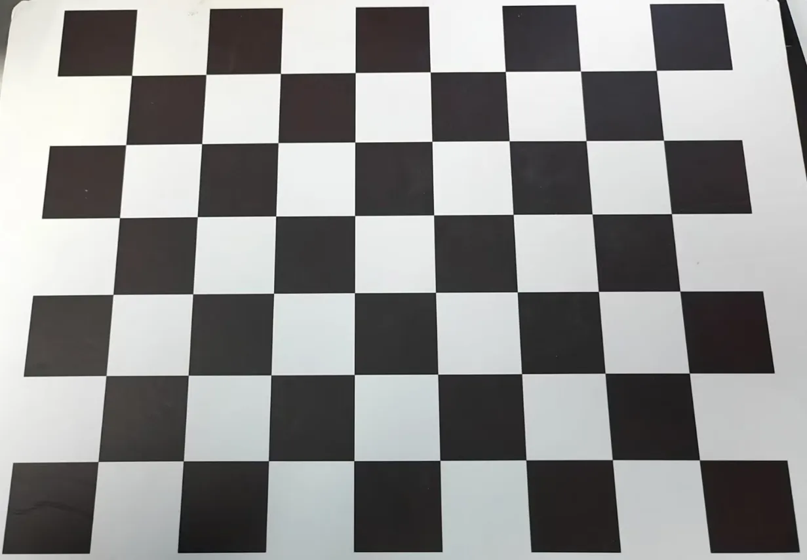
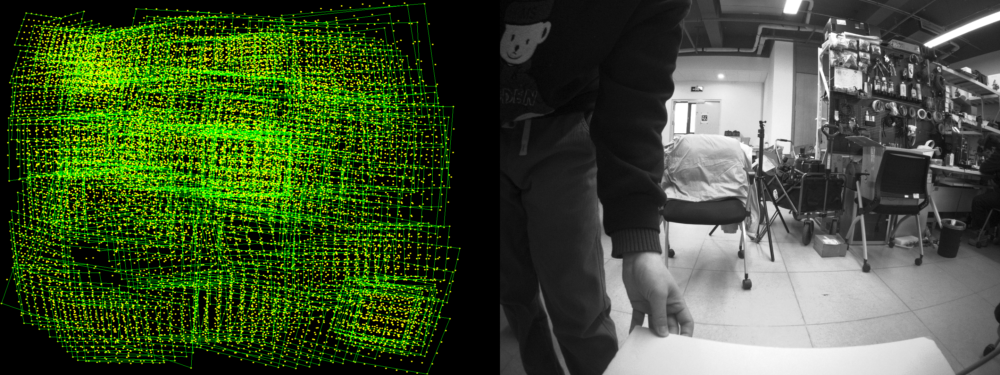
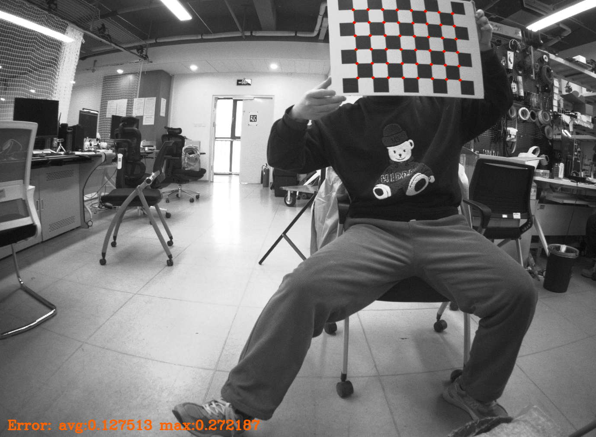
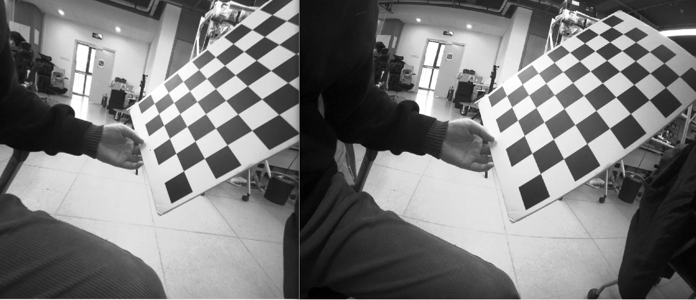

## FishEye-Calib-Tools 鱼眼相机标定工具

## 环境准备
- ROS1 Noetic
- Ceres 2.1.0
- OpenCV 4

```bash
sudo apt install libdw-dev
```

## 编译
```bash
mkdir -p ws_fisheye_calib_tools/src
cd ws_fisheye_calib_tools/src
git clone https://github.com/Derkai52/FishEye-Calib-Tools.git
cd .. && catkin_make
```

## 使用
### 1.采集标定数据
选用示例棋盘格标定板如下：


将相机放置在固定位置，手持棋盘格标定板，执行：

```bash
roslaunch calib_image_saver single_collect_image.launch
```
将标定板在相机视野内进行移动（包含上下左右、近远、倾角等状态），实时采集的数据会出现在左侧的投影点中，当黄色的投影点尽可能覆盖完整个黑色区域后（如下图所示），即可手动关闭程序结束数据采集。图像数据存储路径： [launch 文件中的 image_path](./calib_image_saver/launch/single_collect_image.launch)。




### 2.标定
填入对应参数并执行：

```bash
rosrun camera_model Calibration --camera-name mycamera --input /home/xxx/ws_fisheye_calib_tools/src/fisheye_calib_tools/calib_image_saver/calibration_example_data -w 8
 -h 6 --size 400 --camera-model myfisheye --opencv true
```
|   参数表    |  |
| ----------- | ----------- |
| --camera-name      |  相机自定义名称（最后生成标定文件也以这个开头）       |
| --input   | 读取标定图像的路径        |
| -w   | 棋盘格在宽方向的角点数（不含边界的）        |
| -h  | 棋盘格在高方向的角点数（不含边界的）        |
| --size   | 棋盘格单个格的边长（mm）        |
| --camera-model   | 相机模型类型（Pinhole、Cata、Equidistant、Scaramuzza、Polynomial、FOV、myfisheye（默认自定义的））        |
| -opencv   | 使用OpenCV的检测器（默认）        |
 

等待片刻，标定结果 `<相机名称>_camera_calib.yaml` 会保存到项目根目录，结果图如下所示：



### 3.实时畸变矫正
[设置相机标定配置文件的读取路径](./fishEyeFlattener/launch/flattener.launch)
，执行：
```bash
roslaunch fisheye_flattener flattener.launch
```

左图是矫正后的图，右图原图：

## 引用参考
- https://github.com/gaowenliang/calib_image_saver.git

- https://github.com/gaowenliang/camera_model.git

- https://github.com/alexacw/fishEyeFlattener.git